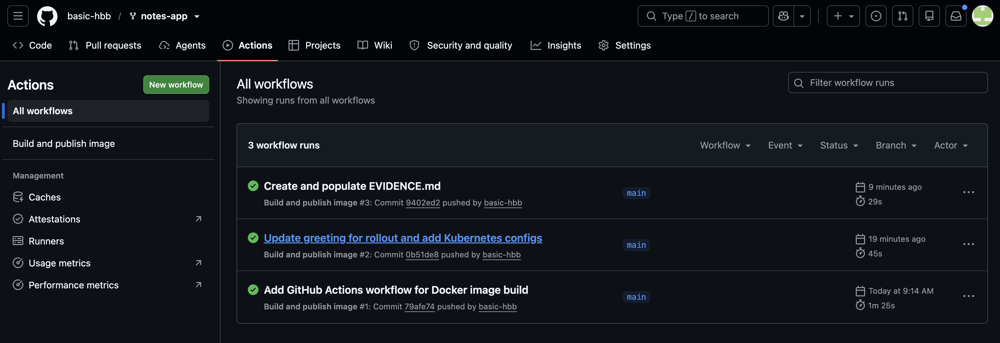
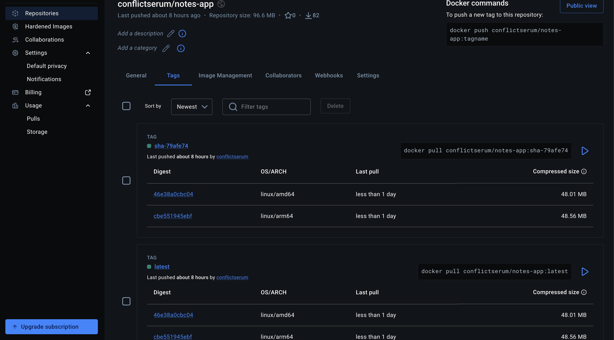

# Lab 5 Evidence

## 1. Pipeline Links
* **Docker Hub Tags:** https://hub.docker.com/r/conflictserum/notes-app/tags
* **GitHub Actions:** https://github.com/basic-hbb/notes-app/actions

## 2. Experiment output

**Experiment 2: 
ismail@Mac ~ % curl http://localhost:8000/

curl -X POST http://localhost:8000/notes \
  -H "Content-Type: application/json" \
  -d '{"body": "hello from kubernetes"}'

curl http://localhost:8000/notes

**Experiment 3:

ismail@Mac ~ % kubectl run curl --rm -it --restart=Never --image=curlimages/curl -- \
  sh -c 'for i in 1 2 3 4 5 6 7 8; do curl -s http://web/; echo; done'
{"message":"Hello from the notes app!","served_by":"web-655dc84b44-5b7rz","service":"notes-app"}

{"message":"Hello from the notes app!","served_by":"web-655dc84b44-r92kf","service":"notes-app"}

{"message":"Hello from the notes app!","served_by":"web-655dc84b44-46ssv","service":"notes-app"}

All commands and output from this session will be recorded in container logs, including credentials and sensitive information passed through the command prompt.
If you don't see a command prompt, try pressing enter.
Session ended, resume using 'kubectl attach curl -c curl -n notes-lab -i -t' command
pod "curl" deleted from notes-lab namespace

## Kubectl after rolling update
ismail@Mac notes-app % kubectl rollout history deployment/web
deployment.apps/web
REVISION  CHANGE-CAUSE
1         <none>
2         <none>
3         <none>

## 4. Kubernetes Status
ismail@Mac notes-app % kubectl get all,pvc
NAME                       READY   STATUS    RESTARTS   AGE
pod/db-6c5c8947cd-l2mh9    1/1     Running   0          19m
pod/web-655dc84b44-lnnc8   1/1     Running   0          5m34s
pod/web-655dc84b44-t9js7   1/1     Running   0          5m40s

NAME          TYPE        CLUSTER-IP     EXTERNAL-IP   PORT(S)    AGE
service/db    ClusterIP   10.96.255.71   <none>        5432/TCP   3h27m
service/web   ClusterIP   10.96.2.206    <none>        80/TCP     3h23m

NAME                  READY   UP-TO-DATE   AVAILABLE   AGE
deployment.apps/db    1/1     1            1           3h27m
deployment.apps/web   2/2     2            2           3h23m

NAME                             DESIRED   CURRENT   READY   AGE
replicaset.apps/db-6c5c8947cd    1         1         1       3h27m
replicaset.apps/web-5bfd7559bc   0         0         0       7m54s
replicaset.apps/web-655dc84b44   2         2         2       23m
replicaset.apps/web-6788b79595   0         0         0       3h23m

NAME                            STATUS   VOLUME                                     CAPACITY   ACCESS MODES   STORAGECLASS   VOLUMEATTRIBUTESCLASS   AGE
persistentvolumeclaim/db-data   Bound    pvc-c146284f-8feb-4146-843c-0e390b3c69cd   1Gi        RWO            standard       <unset>                 3h27m

